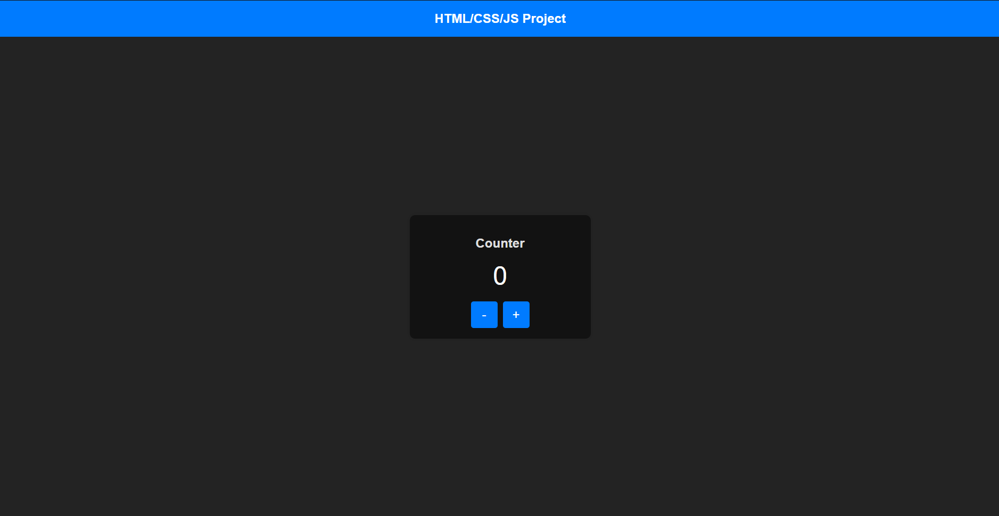

# SimpleSiteGenerator

**SimpleSiteGenerator** is a simple tool for generating basic web pages with HTML, CSS, and JavaScript. This project is ideal for learning the fundamentals of web development or for quickly creating the skeleton of a simple web project.

## Features

- Generates an HTML page with a header, main content, and buttons.
- Automatically includes CSS for basic styling.
- Adds a JavaScript file to handle button interactions.

## Project Structure

The project consists of the following files:

- `main.py` - The main script that sets up the project structure and calls the appropriate classes to generate HTML, CSS, and JavaScript files.
- `html_builder.py` - Contains the `HtmlBuilder` class for generating the HTML file.
- `css_builder.py` - Contains the `CssBuilder` class for generating the CSS file.
- `js_builder.py` - Contains the `JsBuilder` class for generating the JavaScript file.

## Usage

1. **Clone the repository**:

   ```bash
   git clone https://github.com/Artemo01/SimpleSiteGenerator.git
   cd WebPageGenerator
   ```

2. **Run `main.py`**:

   ```bash
   python main.py
   ```

   The program will prompt you to enter the path where you want to create the new project and the project name. Provide the necessary values to generate the project.

3. **Check the generated files**:
   - `index.html` - The HTML file.
   - `index.css` - The CSS file.
   - `script.js` - The JavaScript file.

## Screenshot

Here is a screenshot of the generated webpage:



## Requirements

- Python 3.x
- (Optional) `git` for cloning repositories
